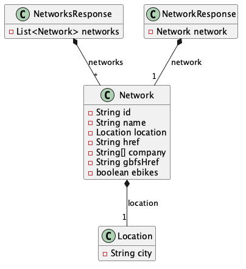
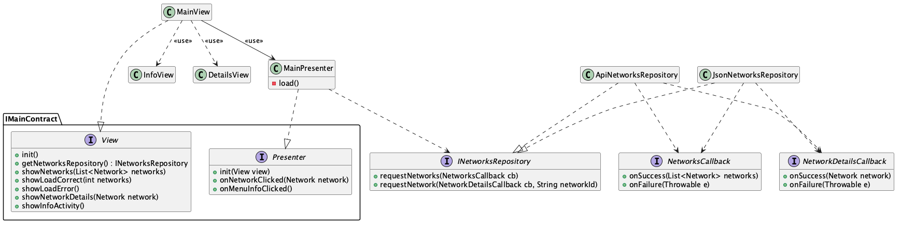
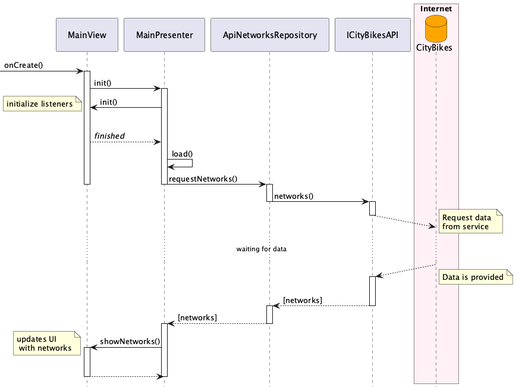

## Dominio



## Arquitectura




## Diagrama de Secuencia

Inicialización de la aplicación hasta que se muestra la lista de redes de bicicletas:



## Regenerar los diagramas

Los archivos `.png` se generan a partir de los `.puml` ejecutando el script incluido en este directorio. El script descarga automáticamente PlantUML (`plantuml.jar`) si no está presente, por lo que solo requiere tener Java instalado.

- **macOS / Linux:**

  ```sh
  ./generate_diagrams.sh
  ```

- **Windows:**

  ```bat
  generate_diagrams.bat
  ```
