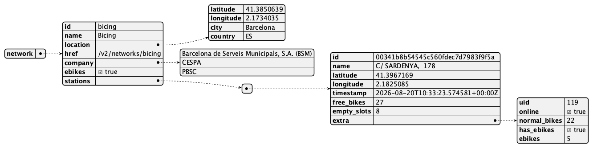

# Información sobre cada Red de Bicicletas (Network)

La aplicación utiliza la [API CityBikes](https://api.citybik.es/v2/) para descargar información sobre redes de bicicletas compartidas.

## Red (Network)

Cada red representa un sistema de alquiler de bicicletas de una ciudad (por ejemplo, Bicing en Barcelona, BiciMAD en Madrid).

<table>
<thead>
<tr>
<th>Nombre en JSON</th>
<th>Descripción</th>
<th>Ejemplo</th>
</tr>
</thead>
<tbody>
<tr>
<td>"id"</td>
<td>Identificador único de la red</td>
<td>"bicing"</td>
</tr>
<tr>
<td>"name"</td>
<td>Nombre de la red</td>
<td>"Bicing"</td>
</tr>
<tr>
<td>"location"</td>
<td>Objeto con la localización (ver tabla Location)</td>
<td></td>
</tr>
<tr>
<td>"href"</td>
<td>Ruta relativa al detalle de la red</td>
<td>"/v2/networks/bicing"</td>
</tr>
<tr>
<td>"company"</td>
<td>Lista de empresas operadoras</td>
<td>["BSM", "CESPA", "PBSC"]</td>
</tr>
<tr>
<td>"gbfs_href"</td>
<td>URL del feed GBFS de la red (opcional)</td>
<td>"https://.../gbfs.json"</td>
</tr>
<tr>
<td>"ebikes"</td>
<td>Indica si la red dispone de bicicletas eléctricas (opcional)</td>
<td>true</td>
</tr>
</tbody>
</table>

## Location

<table>
<thead>
<tr>
<th>Nombre en JSON</th>
<th>Descripción</th>
<th>Ejemplo</th>
</tr>
</thead>
<tbody>
<tr>
<td>"latitude"</td>
<td>Latitud de la ciudad</td>
<td>41.3850639</td>
</tr>
<tr>
<td>"longitude"</td>
<td>Longitud de la ciudad</td>
<td>2.1734035</td>
</tr>
<tr>
<td>"city"</td>
<td>Nombre de la ciudad</td>
<td>"Barcelona"</td>
</tr>
<tr>
<td>"country"</td>
<td>Código del país</td>
<td>"ES"</td>
</tr>
</tbody>
</table>

## Estación (Station)

Cada estación pertenece a una red. Solo se devuelven las estaciones al solicitar el detalle de una red concreta (`GET /v2/networks/{id}`).

<table>
<thead>
<tr>
<th>Nombre en JSON</th>
<th>Descripción</th>
<th>Ejemplo</th>
</tr>
</thead>
<tbody>
<tr>
<td>"id"</td>
<td>Identificador único de la estación</td>
<td>"00341b8b..."</td>
</tr>
<tr>
<td>"name"</td>
<td>Dirección de la estación</td>
<td>"C/ SARDENYA, 178"</td>
</tr>
<tr>
<td>"latitude"</td>
<td>Latitud de la estación</td>
<td>41.3967169</td>
</tr>
<tr>
<td>"longitude"</td>
<td>Longitud de la estación</td>
<td>2.1825085</td>
</tr>
<tr>
<td>"timestamp"</td>
<td>Última actualización (ISO 8601)</td>
<td>"2026-08-20T08:35:24Z"</td>
</tr>
<tr>
<td>"free_bikes"</td>
<td>Número de bicicletas disponibles</td>
<td>22</td>
</tr>
<tr>
<td>"empty_slots"</td>
<td>Número de huecos libres</td>
<td>13</td>
</tr>
<tr>
<td>"extra"</td>
<td>Información adicional (opcional)</td>
<td></td>
</tr>
</tbody>
</table>

# Servicios Disponibles

<https://api.citybik.es/v2/>

## Endpoints

<table>
<thead>
<tr>
<th><strong>Título</strong></th>
<th><strong>Descripción</strong></th>
</tr>
</thead>
<tbody>
<tr>
<td>GET /v2/networks</td>
<td>Lista de todas las redes de bicicletas del mundo (sin estaciones)</td>
</tr>
<tr>
<td>GET /v2/networks/{network_id}</td>
<td>Detalle de una red concreta, incluyendo todas sus estaciones</td>
</tr>
</tbody>
</table>

## Ejemplos de llamadas

- [http://api.citybik.es/v2/networks](http://api.citybik.es/v2/networks) — lista de todas las redes
- [http://api.citybik.es/v2/networks/tuebici](http://api.citybik.es/v2/networks/tuebici) — detalle de TUeBICI (Santander), con todas sus estaciones

## Notas

- La API no requiere autenticación (sin API key).
- No existe filtro por comunidad autónoma; la lista de redes se descarga completa.
- El servicio puede devolver el código HTTP `429 Too Many Requests` si se detecta un User-Agent genérico (por ejemplo, el de OkHttp). Para evitarlo, la aplicación envía la cabecera `User-Agent: Bicis-2026/1.0`.

# Formato JSON

Formato JSON de la respuesta del servicio

